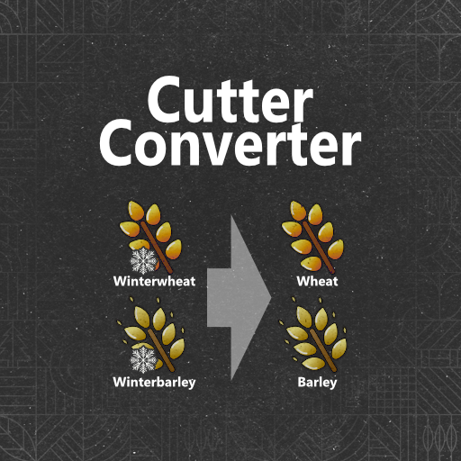

 

<h2>⚠️⚠️ Searching for a mapper who wants to implement this ⚠️⚠️</h2>

 

<h3 align="center"><u>FS25_CutterConverter</u></h3>

    Enables cutter fruit converter via map, rather than per single cutter on their XMLs. This allows the mapper to implement crops such as: Winter wheat becomes wheat after harvesting. Can be used for: 
    - winter wheat => wheat 
    - winter barley => barley 

## For Modders / Mappers
- ### [Implement in your map](./documents/MAPPING.md)

## Credits
* [Sqeep](https://github.com/Sqeep91)

# Copyright
Copyright (c) 2024 [Dennis Schmitt](https://github.com/peppie84).
All rights reserved.

(<a href="#readme-top">back to top</a>)
